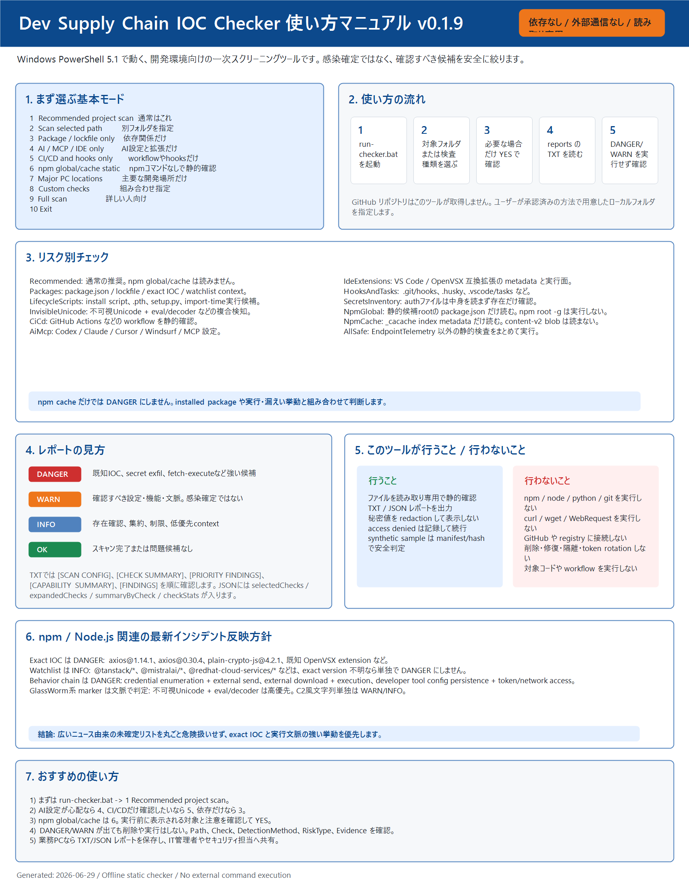

# 図解マニュアル: Dev Supply Chain IOC Checker

対象: Windowsで開発用フォルダや主要な開発環境を安全に確認したい人
更新日: 2026-06-29

まずは下のPNGを見てください。この1枚で、特徴、使い方、検査モード、結果の見方、安全上の注意が分かるようにしています。v0.1.9 ではリスク別チェック選択メニューが追加され、v0.1.11 ではこのツール自身の `reports*` フォルダを通常スキャンから除外するようになりました。



安全性の説明だけを配布先へ渡したい場合は、[安全性と設計上の約束](safety-model-ja.md)も参照してください。

## 1. このツールでできること

このツールは、開発用フォルダやAIエージェント設定、IDE拡張、CI/CD設定などに「注意すべき痕跡」がないかを静的に確認します。

重要な特徴:

- インターネットには接続しません。
- npm、pip、python、node などを実行しません。
- 対象プロジェクトのコードを実行しません。
- ファイル削除、修復、隔離、アンインストールはしません。
- 認証ファイルの中身やトークン値はレポートに出しません。
- ユーザープロファイルや端末ログを見るモードは、明示的に選んだ時だけ動きます。

つまり、このツールは「安全に読むだけ」の一次確認ツールです。

## 2. 最初に使うおすすめモード

まずは `run-checker.bat` をダブルクリックしてください。メニューが出ます。

```text
1. Recommended project scan
2. Scan selected path
3. Package / lockfile risks only
4. AI / MCP / IDE config risks only
5. CI/CD and hooks risks only
6. npm global/cache static check
7. Major PC locations scan
8. Custom checks for current folder
9. Full scan current folder + user profile + endpoint telemetry
10. Exit
```

初心者向けの選び方:

| やりたいこと | 選ぶ番号 | 補足 |
|---|---:|---|
| 今開いているプロジェクトだけ確認したい | 1 | 最初はこれがおすすめ |
| 別のフォルダを指定して確認したい | 2 | パスを入力します |
| 依存関係だけ確認したい | 3 | package.json や lockfile 中心 |
| AI/MCP/IDE設定だけ確認したい | 4 | agent 設定や VS Code 互換拡張 |
| CI/CDやhooksだけ確認したい | 5 | GitHub Actions や hooks |
| npm global/cache を静的に確認したい | 6 | 実行前に `YES` 確認があります |
| PC内の主要な開発場所だけ広めに確認したい | 7 | 実行前に `YES` 確認があります |
| 自分でチェックを組み合わせたい | 8 | 詳しい人向け |
| 端末ログやDNSキャッシュなども含めたい | 9 | 詳しい人や管理者と一緒に使うのがおすすめ |

通常は、まず `1` か `2` で対象プロジェクトだけを確認してください。

## 3. 一番安全な基本手順

1. 調べたいプロジェクトフォルダをエクスプローラーで開きます。
2. このツールの `run-checker.bat` を起動します。
3. メニューで `1` を選びます。
4. スキャンが終わるまで待ちます。
5. `reports` フォルダに作成された `.txt` レポートを開きます。
6. まず `[SUMMARY]` と `[PRIORITY FINDINGS]` を確認します。

レポート例:

```text
OverallResult: WARN

[SUMMARY]
DANGER: 0
WARN:   1
INFO:   3
OK:     1
```

## 4. レポートの見方

重要度は次の4種類です。

| 表示 | 意味 | 最初にすること |
|---|---|---|
| `DANGER` | 強く確認すべき候補 | 削除せず、内容と場所を確認 |
| `WARN` | 注意して確認すべき候補 | なぜ出たかを読む |
| `INFO` | 参考情報 | 必要に応じて確認 |
| `OK` | スキャン完了や問題なし | 通常は対応不要 |

`DANGER` は「感染確定」ではありません。ただし、優先して確認すべきサインです。

## 5. まず見るべき場所

TXTレポートでは、次の順に見ると分かりやすいです。

1. `[SUMMARY]`
2. `[PRIORITY FINDINGS]`
3. `[CAPABILITY SUMMARY]`
4. `[FINDINGS]`

`[PRIORITY FINDINGS]` は、特に優先して確認すべきものを上に集めた欄です。

優先される代表例:

- 既知の危険IOCに一致したもの
- トークンや認証情報を外部に送る疑いがあるもの
- 実行設定の中に外部取得して実行するパターンがあるもの

`[CAPABILITY SUMMARY]` は、Codex skill や plugin などが外部API、ダウンロード、インストール、書き込み機能を持つ場合の集約です。これは感染証拠ではありませんが、そのツールを使う前に提供元や用途を確認するための情報です。

## 6. finding の項目

各 finding には、次のような情報が出ます。

| 項目 | 意味 |
|---|---|
| `Category` | 何を検出したか |
| `Path` | 見つかった場所 |
| `Line` | 何行目付近か。空の場合もあります |
| `SourceContext` | 通常ファイル、AI設定、実行スクリプト、cache、検証sampleなどの文脈 |
| `RiskType` | リスクの種類 |
| `Confidence` | 確度。`high`、`medium`、`low` |
| `Check` | どの検査種類で見つかったか |
| `DetectionMethod` | 静的ファイル、静的パス、metadata、inventory など |
| `Evidence` | 秘密値を伏せた根拠 |
| `Recommendation` | 次に確認すること |

`RiskType` の見方:

| RiskType | 意味 |
|---|---|
| `known-ioc` | 既知の危険指標に近い |
| `active-exfil` | 認証情報の外部送信が疑われる |
| `fetch-execute` | 外部取得して実行する形に近い |
| `capability` | 外部API、インストール、書き込み機能を持つ |
| `posture` | 設定上の注意点 |
| `inventory` | 存在確認 |
| `limitation` | スキャン上の制限や補足 |

## 7. DANGER が出た時

まず、次のことはしないでください。

- 見つかったファイルを削除する
- URLにアクセスする
- npm、pip、python、node などを実行する
- トークンや認証ファイルをチャットに貼る
- 拡張機能やツールを慌ててアンインストールする

推奨手順:

1. レポートの `.txt` と `.json` を残します。
2. `Path` に書かれた場所を確認します。
3. ファイルを実行せず、内容を読むだけにします。
4. `Category`、`RiskType`、`Evidence` を確認します。
5. 業務PCなら、IT管理者やセキュリティ担当に相談します。

## 8. WARN が出た時

`WARN` は「すぐ危険確定」ではありません。

よくある `WARN` の例:

- MCPやAIエージェント設定で `npx` が未固定
- GitHub Actions の権限が広い
- skill や plugin が外部APIへ書き込める機能を持つ
- 実行スクリプトに外部取得やインストール機能がある

確認ポイント:

- そのファイルは自分が入れたものか
- そのツールやpluginは信頼できる提供元か
- バージョン固定されているか
- 外部送信先が自分の想定どおりか

## 9. INFO が出た時

`INFO` は参考情報です。

例:

- 認証ファイルが存在する
- npm cache blob を本文スキャン対象から除外した
- GitHub APIを読むために `GITHUB_TOKEN` を使うコードがある
- このツール自身の検証sampleを親スキャンでスキップした

`INFO` だけなら、通常は慌てる必要はありません。

## 10. `tests/samples` について

このリポジトリには `tests/samples` という検証用フォルダがあります。

ここには、検出動作を確認するための作り物ファイルが入っています。

- 実マルウェアではありません。
- 外部から危険ファイルをダウンロードしたものではありません。
- 偽のURLや偽のトークン表現が含まれます。
- 直接スキャンすると `DANGER` や `WARN` が出るのは正常です。

親フォルダや Major PC locations scan では、このツール自身の manifest で確認できた既知sampleだけをスキップします。

重要:

- 他のプロジェクトの `tests/samples` は自動的に信用しません。
- 未知ファイルや改変されたsampleはスキップせず通常スキャンします。

## 11. Major PC locations scan の意味

`7. Major PC locations scan` は、PC全体を総当たりする機能ではありません。

主に見る場所:

- `CodexProjects`
- `Projects`
- `source\repos`
- `repos`
- `dev`
- `workspace`
- `Documents\GitHub`
- VS Code / Cursor / Windsurf などの拡張機能
- Claude / Cursor / Codex などのAIエージェント設定
- 認証ファイルの存在確認

見ないもの:

- `C:\` 全体
- `C:\Windows` 全体
- `Program Files` 全体
- 端末ログ、DNSキャッシュ、イベントログ

端末ログやDNSキャッシュまで見る場合は `9. Full scan` ですが、初心者は詳しい人と一緒に使うのがおすすめです。

## 12. コマンドで使う場合

通常はBATメニューで十分です。

コマンドで使う場合:

```bat
run-checker.bat current C:\Path\To\Project
```

主要箇所だけ見る場合:

```bat
run-checker.bat major
```

PowerShellから直接実行する場合:

```powershell
powershell.exe -NoLogo -NoProfile -ExecutionPolicy Bypass -File .\Scan-DevSupplyChain.ps1 -Path C:\Path\To\Project -ReportDir .\reports
```

検査種類を指定する場合:

```powershell
powershell.exe -NoLogo -NoProfile -ExecutionPolicy Bypass -File .\Scan-DevSupplyChain.ps1 -Path C:\Path\To\Project -Checks Packages,AiMcp,CiCd -ReportDir .\reports
```

## 13. GitHubリポジトリを確認したい場合

このツールはオフライン専用です。GitHubへ直接アクセスしてダウンロードする機能はありません。`git clone`、`git archive`、GitHub API 取得機能も実装していません。

確認したい場合は、すでにPC上にあるローカルフォルダを指定してください。

例:

```bat
run-checker.bat current C:\Users\yourname\Documents\GitHub\some-repo
```

## 14. 最後の判断

このツールの結果は、次のように受け止めてください。

- `DANGER`: 優先して確認する候補
- `WARN`: 設定や機能を確認する候補
- `INFO`: 状況理解のための補足
- `OK`: スキャン完了または問題候補なし

このツールは感染を確定するものでも、完全な安全を証明するものでもありません。安全に一次確認し、次に見るべき場所を絞るための道具です。
